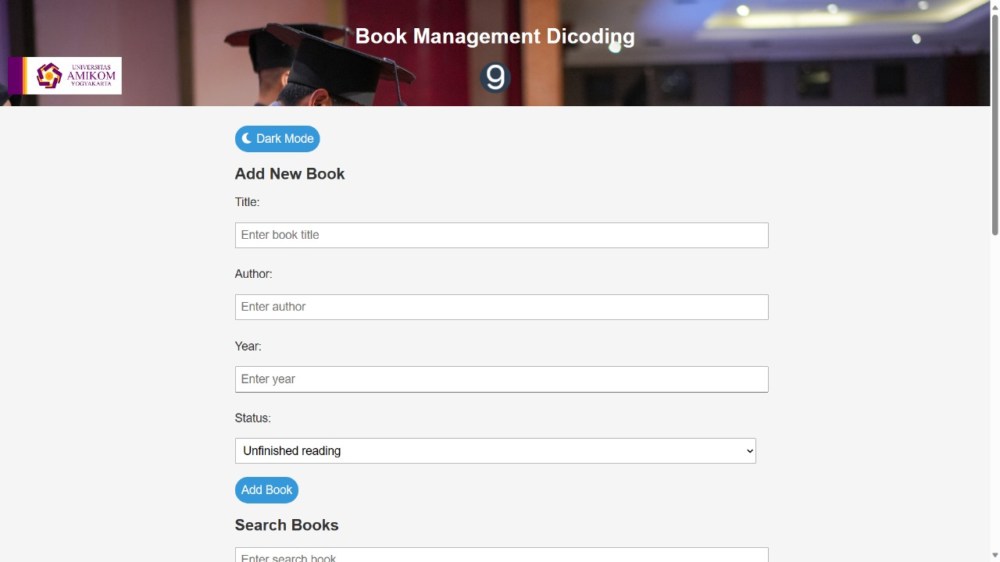
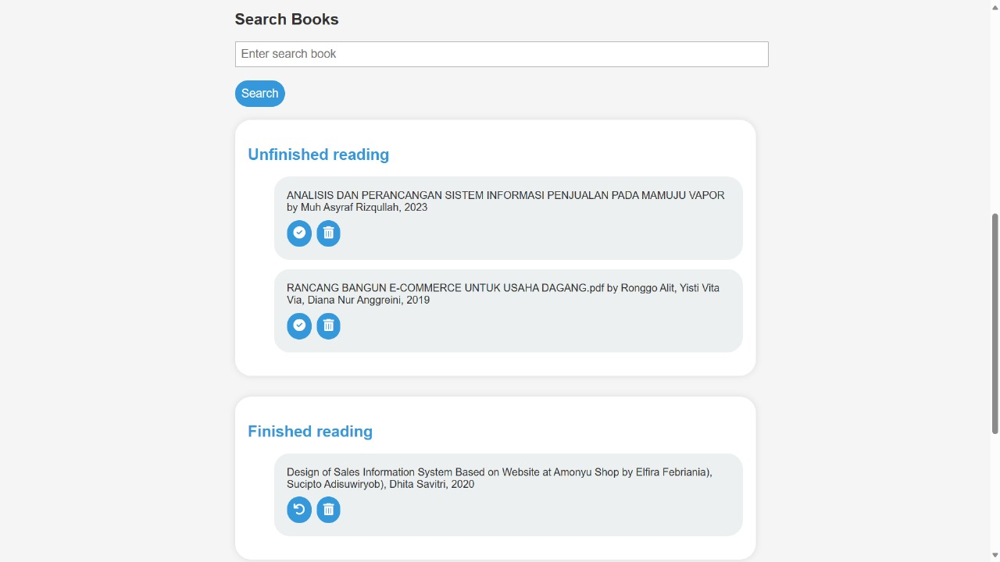

# Book Management Project




Manage your reading list with ease! This project allows you to keep track of books you've read and want to read.

## Features

- Add new books with title, author, year, and status.
- Mark books as finished or unfinished.
- Search for books based on titles.
- Dark mode for comfortable reading.

## Demo

[Live Demo]([link-to-your-live-demo](https://asyrafrizqullah01.github.io/Books-Dicoding/))

## Getting Started

1. Clone the repository.
   ```bash
   git clone https://github.com/asyrafrizqullah01/Books-Dicoding.git
   cd book-management

## Author

[Muh Asyraf Rizqullah](https://www.instagram.com/asyraf.rizqullah/?hl=en)
